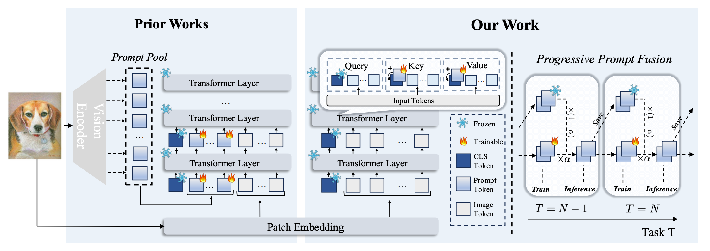

# ICCV 2025 paper Additive-Prompt-Tuning

 :bookmark_tabs:[`Paper`](https://arxiv.org/abs/2503.07979) 
 :black_nib:[`BibTex`](#black_nib-citation) 

**Authors**: [Haoran Chen](https://haoranchen.github.io/), Ping Wang, Zihan Zhou, Xu Zhang, [Zuxuan Wu](https://zxwu.azurewebsites.net/),  [Yu-Gang Jiang](https://scholar.google.com/citations?user=f3_FP8AAAAAJ&hl=en)


## :mag: Overview
<p align="center">
  
<be>
</p>

## Contact
Feel free to contact us if you have any questions or suggestions 
Email: chenhran21@m.fudan.edu.cn

## :black_nib: Citation
If you use our code in this repo or find our work helpful, please consider giving a citation:

```
@article{chen2025achieving,
  title={Achieving More with Less: Additive Prompt Tuning for Rehearsal-Free Class-Incremental Learning},
  author={Chen, Haoran and Wang, Ping and Zhou, Zihan and Zhang, Xu and Wu, Zuxuan and Jiang, Yu-Gang},
  booktitle={ICCV 2025},
  year={2025}
}
```
